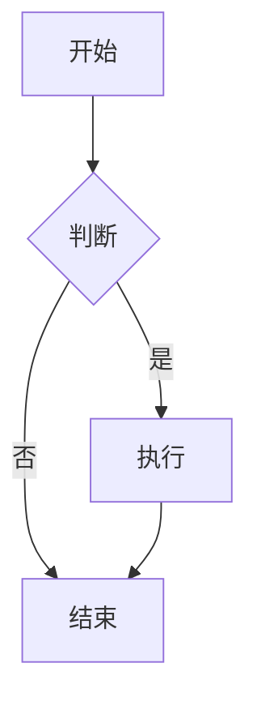

```markdown
---
title: Markdown功能快速测试
date: 2026-01-22 22:00:00 +0800
categories: [测试]
tags: [markdown, 功能测试]
math: true
mermaid: true
---

# 一级标题测试

## 二级标题

### 三级标题

---

**加粗** | *斜体* | `代码` | ~~删除线~~

---

## 列表测试

- 无序列表项1
- 无序列表项2
  - 子项A
  - 子项B
- 列表项3

1. 有序列表
2. 第二项
3. 第三项

---

## 链接与图片

[我的博客](https://riluo-ya.github.io/blog/)


---

## 代码块测试

```python
def hello():
    print("Hello, Chirpy!")
    return True
```

---

引用块

> 这是一个引用块
可以包含格式和`代码`

---

表格测试

功能	状态	说明	
Jekyll	✔️	静态生成	
Chirpy	✔️	主题	
GitHub	✔️	托管	

---

数学公式

行内公式：E = mc^2

块级公式：

\int{0}^{\infty} e^{-x} dx = 1

---

Mermaid图表



---

测试完，如果所有内容都能正常显示，说明配置成功！

简短测试完

```
